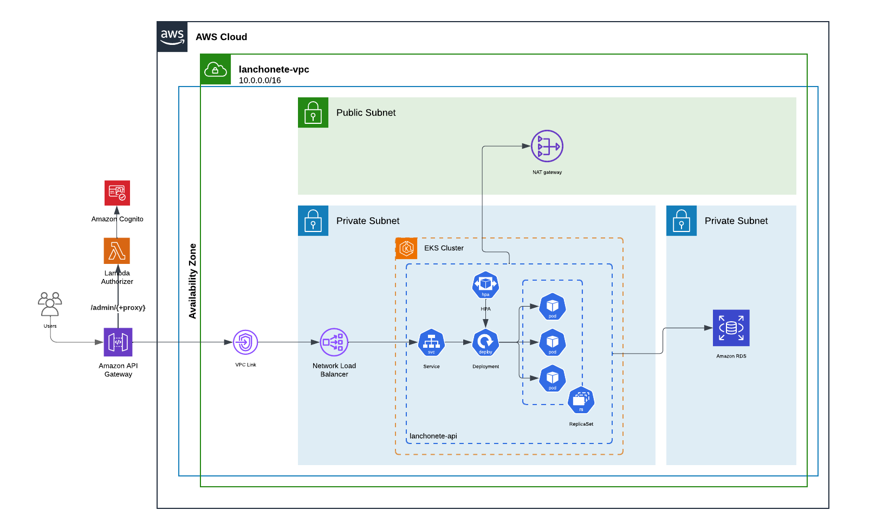

# 8SOAT FIAP Tech Challenge | Grupo 41 | Customers API

[](https://sonarcloud.io/summary/new_code?id=8SOAT-GRUPO-41_tech-challenge-fase-4-customers)

[](https://sonarcloud.io/summary/new_code?id=8SOAT-GRUPO-41_tech-challenge-fase-4-customers)

## Descrição do Projeto

Este microserviço, desenvolvido pelo Grupo 41, representa o módulo de customers do sistema de gestão operacional de uma lanchonete. O foco deste serviço é gerenciar as informações dos clientes, permitindo operações eficientes e seguras de cadastro e consulta.

## Como Iniciar o Projeto Localmente

Para iniciar o microserviço de customers, siga os passos abaixo:

1. Certifique-se de que o Docker está instalado e em execução.
2. No diretório raiz do projeto, execute o seguinte comando:

   ```bash
   docker-compose up

## Como Iniciar o Projeto no Kubernetes

[Guia de deploy helm + k8s](k8s/README.md)

## Arquitetura


